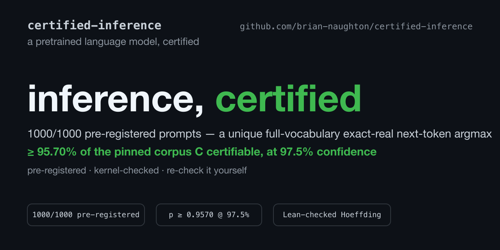

[](https://github.com/brian-naughton/certified-inference/actions/workflows/verify.yml)

# Certified Inference

*A pre-registered, exact-real, full-vocabulary next-token certificate for a real pretrained LayerNorm language model — every sampled prompt certified, independently re-checkable without Torch, and wrapped in a Hoeffding lower bound whose statistical theorem is kernel-checked in Lean.*

> **On a pinned finite TinyStories-1M token-id corpus `C` at context length 16, we pre-registered a with-replacement sample of 1000 prompts — seed and budget committed before any result was seen — and certified that every one of them has a unique full-vocabulary exact-real next-token argmax at `P ≤ 256`. By the stated Hoeffding bound, with confidence ≥ 97.5% (δ₁ = 1/40), at least 95.70% of `C` is certifiable under this engine and escalation policy. The statistical lower-bound theorem is kernel-checked in Lean; each per-sample fact is interval-certified and re-derived by a torch-free checker sharing an audited arithmetic core; the sampling and harness provenance is audited.**

## What this is, in plain English

Our two sister projects certified *finite* models: [verified-circuits](https://github.com/brian-naughton/verified-circuits) proved `Spec == Circuit == Model` for a tiny transformer we trained ourselves, and [certified-grokking](https://github.com/brian-naughton/certified-grokking) certified the canonical Nanda et al. grokking checkpoint over its entire 12,769-input domain. Both could enumerate every input. This project takes the harder step: a **real pretrained LayerNorm language model** whose input space is far too large to enumerate, where the honest guarantee is *statistical*, not exhaustive.

We do three things and keep each one carefully bounded:

1. **Per sample, we certify the exact-real function.** For a given prompt, we prove — with outward-rounded interval arithmetic over the published float32 weights read as exact dyadic rationals — that one token's logit is strictly above all 50,256 others. That is a *unique full-vocabulary exact-real next-token argmax*, certified, not measured.

2. **Over a pinned finite corpus, we make one honest statistical claim.** We pre-registered a with-replacement sample from a fixed, sha-pinned corpus `C`, certified every drawn prompt, and turned "1000 of 1000 certified" into a Hoeffding lower bound on the certifiable fraction of `C`. The claim quantifies over **`C` only** — not TinyStories validation, not story prompts generally, not any deployment distribution.

3. **We wrapped the statistics in a machine-checked theorem.** The Hoeffding lower-confidence bound is proved in Lean 4 + Mathlib and kernel-checked. The kernel earned its keep: it caught a mis-specified tail direction in our own task brief before the number was ever stated (see [The Lean theorem](#the-lean-theorem-kernel-checked)).

The model is small and the corpus is narrow by design — the contribution is the **discipline and checkability** of the claim (pre-registered, exact-real, torch-free re-derived, kernel-checked wrapper), not scale. This closes the "Early signals" preview at the end of [certified-grokking](https://github.com/brian-naughton/certified-grokking): the preliminary TinyStories-1M and GPT-2-small experiments teased there are now a pre-registered, independently checkable result.

### The claims at a glance

A reviewer asked for the claims in one table — here it is:

| Claim | Scope | Not claimed |
|---|---|---|
| 1000/1000 pre-registered TinyStories-1M ctx-16 prompts certified | Pinned finite corpus C; exact-real semantics; full-vocabulary argmax; P ≤ 256 | Not deployment behaviour; not TinyStories generally; not all prompts |
| ≥ 95.70% of C certifiable at 97.5% confidence | With-replacement draws from C; Hoeffding inequality kernel-checked in Lean | Sampling bridge not formalised in Lean (audited provenance) |
| GPT-2-small: 8/8 full-vocabulary certificates at P = 320 | Prestige/scaling confirmation | No population claim; torch-free checker path for GPT-2 not yet built |

## The trilogy

This repository is the third of three, built in sequence, each answering an objection to the one before it. Together they push a single question: how far can a machine-checkable guarantee about a neural network be taken?

1. **[verified-circuits](https://github.com/brian-naughton/verified-circuits)** — `Spec == Circuit == Model` for a tiny transformer trained from scratch on a complete finite task: a length-generic Lean theorem for the circuit↔spec half, and a rigorous interval certificate over the whole 65,536-input domain. The cleanest end-to-end chain, on a model of our own.
2. **[certified-grokking](https://github.com/brian-naughton/certified-grokking)** — the same discipline applied to a model we did **not** train: the canonical Nanda et al. modular-addition "grokking" checkpoint, certified over all 12,769 inputs, with the ideal clock decoder proved in Lean and the certified finding that the celebrated clock circuit is *decision-complete but not margin-dominant*.
3. **certified-inference** — *you are here.* A real pretrained LayerNorm language model, too large to enumerate: pre-registered, exact-real, full-vocabulary next-token certificates over a pinned corpus, wrapped in a Hoeffding lower bound whose statistical theorem is kernel-checked in Lean.

The arc: a guarantee we can close end-to-end → the same guarantee on someone else's celebrated model, including the point where its story runs out → the guarantee at a scale where exhaustive checking is impossible and the honest claim becomes statistical. This repository does **not** have the same formal closure as the first two, and we do not pretend it does.

## Status at a glance

Four properties, each naming exactly what it claims, what is trusted to establish it, and the artifact that carries it. Nothing here is "certified end-to-end" — the wrapper is a **kernel-checked statistical wrapper over audited certificate records**, and the trust strata are enumerated in [Trust boundary](#trust-boundary) below.

| Property | Claim | What is trusted | Artifact |
|---|---|---|---|
| **CI-A · φ₁ (headline)** | Every one of 1000 pre-registered ctx-16 TinyStories-1M prompts has a **unique full-vocabulary exact-real** next-token argmax certified at `P ≤ 256`; hence ≥ **95.70%** of `C` certifiable at confidence ≥ 97.5%. | Outward-rounded interval arithmetic over the sha-pinned checkpoint, re-derived torch-free with a shared audited core. | `certificates/headline/tinystories-headline.cert.jsonl` |
| **CI-A · φ₁ (GPT-2 confirmation)** | 8/8 full-vocabulary GPT-2-small exact-real argmax certificates at `P = 320` — **prestige confirmation / scaling evidence, no population claim**. | Same generator instrument; **checker path not yet GPT-2-complete** (future work). | `certificates/gpt2-confirmation/` |
| **CI-B · precision profile** | Required-`P` p95 = **160** across ctx 8/16/32, 300/300 certified, zero abstentions — a **calibration table, not a law** (single-family grid, A3). | Measured on the same engine; all 300 records torch-free re-derived. | [`docs/calibration-report.md`](docs/calibration-report.md) |
| **CI-C · statistical wrapper** | The one-sided Hoeffding lower-confidence bound `p ≥ k/n − √(ln(1/δ)/2n)`. | **Lean 4 + Mathlib kernel proof**, axioms `[propext, Classical.choice, Quot.sound]`; sampling bridge audited, not formalised. | `proofs/HoeffdingWrapper/` |
| **CI-D · φ₂_joint** | In the same frozen run the pinned float32 harness agreed with the certified exact-real argmax on 1000/1000; hence ≥ **95.70%** of `C` at confidence ≥ 97.5% on the joint event "certified **and** harness-agrees". | Interval-certified argmax + **provenance-audited harness leg** (an implementation transcript, determinism gate passed — not binary32 semantics). | headline records + `docs/prereg-dryrun.md` §4 |

**Prefer a paper?** The whole artifact is summarised in a short typeset [technical note (PDF)](docs/note/certified-inference-note.pdf) — the claim, the pre-registration choreography, the theorem, the trust strata, and the strengthening agenda.

## The headline

The number you would quote comes out of the **verification** path, not the generator. After the pre-registered run, the independent torch-free checker re-derives all 1000 records from the hex weight export and, only on a full (non-sampled) headline pass, prints the population claim itself:

```
$ python3.11 certificates/check.py \
    --weights certificates/tinystories-1M.weights.json \
    --corpus certificates/corpora/tinystories-val.ids.json \
    --cert certificates/headline/tinystories-headline.cert.jsonl \
    --prereg certificates/prereg/headline --jobs 6

VERIFIED (1000 records re-derived from hex weights, all records, headline)
population claim: p >= 0.9570 at confidence >= 1-1/40 (phi1)
population claim: p >= 0.9570 at confidence >= 1-1/40 (phi2_joint; harness leg provenance-audited, not re-derived)
```

Read precisely (the [frozen claim text](docs/claim-freeze.md)):

- **φ₁ — the title claim.** For a pre-registered with-replacement sample of `n = 1000` prompts from the pinned finite TinyStories-1M token-id corpus `C` at context length 16, **every** sampled prompt had a unique full-vocabulary exact-real next-token argmax certified at `P ≤ 256` (in fact the escalation ladder never rose past `P = 192`). By the stated Hoeffding bound, with confidence ≥ 97.5% (δ₁ = 1/40), **at least 95.70%** of `C` is certifiable under this engine and escalation policy (`L₁ = 1 − 0.042947 = 0.957053`, displayed rounded **down** so the display can never overstate the certified rate).
- **φ₂_joint — the subtitle claim.** In the same frozen run the pinned float32 harness agreed with the certified exact-real argmax on 1000/1000 samples, giving a separate lower bound `L₂ = 95.70%` on the joint event, with confidence ≥ 97.5% (δ₂ = 1/40). The determinism gate **passed** (bit-identical transcripts). This is pinned-environment conformance, **not** a broad deployment-gap statement.

Every number here is display-rounded in the safe direction and traceable to a committed artifact: `prereg_ref = 7f846ddb8fecc01c9d047e41ef64f1bf0efe1eddce9715f6654614beb770ea09`, `corpus_sha256 = de3579e9…`, `checkpoint_sha256 = 07f9609e…`.

## The story

### Pre-registration, committed before the results

The whole point of a statistical headline is that the sample was fixed **before** the outcome was known. We enforce that with commit choreography, not trust:

- **Commit 1 — the precommitment (no results).** `prereg.json`, `sample-index.json`, and [`docs/claim-freeze.md`](docs/claim-freeze.md) — every parameter bound, **no certificate records present**. The seed is `20260703` — the project date 2026-07-03, declared as a nothing-up-my-sleeve number. The pre-registration hashes to `prereg_sha256 = 7f846ddb…`, and the with-replacement draw of `n = 1000` indices (196 distinct in `[0, 199]`, duplicates kept, **never** deduplicated) is frozen in `sample-index.json`.
- **Commit 2 and later — the certificate records.** Only after commit 1 does certification begin; every headline record carries `prereg_ref = 7f846ddb…`.
- **Gate — no claim before the checker passes.** The torch-free checker must re-derive every record from the hex weights, re-validate the exact δ split, and **assert full-corpus completeness** (no silently omitted hard prompt) before any number is stated.

The pre-registration *witness* proves determinism, not pre-commitment — a `prereg.json` can be regenerated after the fact and still verify. The actual defence is the commit's own public timestamp with no results in it. We say so plainly in the [threat model](docs/threat-model.md). The end-to-end machinery — including the failure paths that must *reject* a dropped, extra, or mixed-provenance record — is exercised in [`docs/prereg-dryrun.md`](docs/prereg-dryrun.md).

### Replicated under public pre-commitment (R2)

An external review made a fair point: run 1's freeze-before-results ordering rests on
self-attested git timestamps, because the whole repository was pushed in one batch after
the results existed (see the threat model's pre-registration entry). So we upgraded the
protocol and replicated. On 2026-07-04 a second freeze — seed 20260704, same corpus,
same n = 1000, same frozen claim text — was **pushed to this public repository before any
R2 certificate existed** (tag `prereg-r2`; GitHub's server-side push timestamp
2026-07-04T08:22:26Z; an OpenTimestamps receipt for the freeze commit is committed
alongside it). The run then executed and the torch-free checker re-derived all 1000
records against that freeze: **1000/1000 certified, 1000/1000 harness-agreed, zero
abstentions — the identical bound, `p >= 0.9570` at `>= 97.5%` confidence per property.**
Records and logs live under `certificates/headline-r2/` and `certificates/prereg/headline-r2/`;
the freeze-to-results ordering for R2 is third-party attested, not self-attested.

### The Lean theorem, kernel-checked

The statistical wrapper is not a hand-wave. `proofs/HoeffdingWrapper/` proves, in Lean 4 + Mathlib:

- `hoeffding_lower_confidence` — for `n` independent `[0,1]`-valued variables with common mean `p`, with probability ≥ `1 − δ` the true mean is at least the empirical mean minus `√(ln(1/δ)/(2n))`;
- `hoeffding_lower_confidence_count` — the count form matching the claim wording: any certified success count `k ≤ ∑ Bᵢ` yields `p ≥ k/n − √(ln(1/δ)/(2n))`.

Both are **kernel-checked**, zero `sorry`, axioms exactly `[propext, Classical.choice, Quot.sound]` (`Classical.choice` enters through Mathlib's classical real analysis — a larger trusted base, disclosed, not a weaker one).

The best advertisement for the methodology is that **the kernel caught our own mistake.** The task brief's sketch aimed the concentration at the upper tail of `∑ (p − Bᵢ)` — but that tail controls the *upper* confidence bound `p ≤ k′/n + ε`. The lower bound `p ≥ k/n − ε` needs the upper tail of `∑ (Bᵢ − p)`. Both obey the same `exp(−2nε²)` bound by symmetry, so the error was invisible to the arithmetic; the Lean type-checker is what surfaced the flip. The formalisation proves the direction the headline actually needs, and the header note in `proofs/HoeffdingWrapper/Basic.lean` records the correction in full.

"Kernel-checked" here means exactly the **statistics**. The per-sample facts remain interval-certified; the finite-corpus sampling bridge (that seeded with-replacement draws instantiate the theorem's i.i.d. hypotheses) is deliberately **not** formalised — it is audited provenance ([`docs/PROVENANCE.md`](docs/PROVENANCE.md)). The wrapper is never described as "certified end-to-end".

### The calibration table

Before spending the statistical budget we measured how much precision certification actually costs, over 300 samples (ctx 8/16/32, 100 each). The result is tame: **300/300 certified, zero abstentions, required-`P` p95 = 160** at every context length — and all 300 records were re-derived bit-identically by the torch-free checker (~14 min). This is a **calibration table**, not a precision-depth *law*: the Phase 1 grid degenerates to a single model family, so no cross-family slope is estimable (the fit's `r² = 1.0000` is definitional, one point). The full profile, with runtime/memory quantiles and the honest degeneracy note, is in [`docs/calibration-report.md`](docs/calibration-report.md).

### GPT-2-small, as prestige confirmation

To show the method reaches a larger, widely studied model, we certified `n = 8` full-vocabulary (50,257-token) exact-real argmax certificates for GPT-2-small on the pinned WikiText-103 corpus at ctx 16: **8/8 certified**, all at the first ladder rung `P = 320`, exact-`Fraction` margins ranging **0.001064 – 1.809204**. This is **prestige confirmation / scaling evidence — it carries no population or statistical-headline language**, by design. Two honesties travel with it: the tightest sample (index 5, margin 0.001064) still clears its logit-interval width by ~12.1 bits, an honest near-tie; and the torch-free checker is **not yet GPT-2-complete** (its residual-stream wiring is TinyStories-shaped, and the GPT-2 hex export is ~2.1 GB, gitignored), so these are certificates from the same generator instrument, **not yet independently re-derived by a second torch-free instrument**. Closing that gap is future work. Details in [`docs/PROVENANCE.md`](docs/PROVENANCE.md).

## Reviewer quickstart — a trust ladder

Five rungs, increasing in cost and coverage. The first three need no large download and no Torch; each says what trusting it actually buys you.

**Rung 1 — the stdlib tests, no downloads** (~3 min, Python 3.11 only):

```
python3.11 -m pytest -m "not slow and not torch" -q
```

Trusting this buys you: the interval/exact core, the certificate schema, the exact-rational δ/pre-registration machinery, and the torch-free checker are self-consistent, and sample records re-derive from the weights. (119 tests; the torch loader lane is excluded here — it exercises the very boundary the checker replaces — and runs under `pytest -m torch` locally.)

**Rung 2 — the sampled checker re-derivation** (~30 s, torch-free):

```
python3.11 certificates/check.py \
  --weights certificates/tinystories-1M.weights.json \
  --corpus certificates/corpora/tinystories-val.ids.json \
  --cert certificates/calibration/tinystories_ctx8_P256.jsonl --sample 50
```

Trusting this buys you: a sample of the committed certificate records is re-derived bit-identically from the 65 MB committed hex weights and the committed token-id corpus alone — the certificates are not fabricated.

**Rung 3 — the full headline re-derivation + the population claim** (~26 min at `--jobs 6`, measured on the full 1000-record pass under load — sharing the box with a concurrent run; the 300-record calibration re-derivation took ~14 min):

```
python3.11 certificates/check.py \
  --weights certificates/tinystories-1M.weights.json \
  --corpus certificates/corpora/tinystories-val.ids.json \
  --cert certificates/headline/tinystories-headline.cert.jsonl \
  --prereg certificates/prereg/headline --jobs 6
```

Trusting this buys you: **the headline number itself**, printed by the verified path — every one of the 1000 pre-registered records re-derived from the hex weights, full-corpus completeness asserted against the frozen sample multiset (so no hard prompt can be silently omitted), and the Hoeffding population claim computed from the checker's own re-derived count. This is the command that prints the `VERIFIED …` and `population claim: p >= 0.9570 …` lines quoted above.

**Rung 4 — the Lean proof** (minutes, with the Mathlib cache):

```
cd proofs && lake exe cache get && lake build
```

Trusting this buys you: the Hoeffding lower-confidence theorem is kernel-checked, and the build prints the axiom audit `[propext, Classical.choice, Quot.sound]` for both theorems and fails on any `sorry`.

**Rung 5 — the pinned artifacts and the harness (φ₂_joint).** The determinism gate is a genuinely runnable CLI (`python3.11 -m certinf.harness …`, transcript in [`docs/prereg-dryrun.md`](docs/prereg-dryrun.md) §4) and requires the sha-pinned checkpoint download. Trusting it buys you the φ₂_joint leg: empirical confirmation that the pinned float32 harness reproduces the certified exact-real argmax, bit-identically across repeats, in the pinned environment.

## Trust boundary

The wrapper claim rests on **three strata**, and it is worth naming which is which — the guarantee is only as strong as the weakest one a given claim depends on:

1. **Kernel-checked statistics.** The Hoeffding lower-confidence theorem (`proofs/HoeffdingWrapper/`), axioms `[propext, Classical.choice, Quot.sound]`. This is the only kernel-checked object; it certifies the *inequality*, not the per-sample facts.
2. **Interval-certified per-sample records.** Each record's `CERTIFIED` status is a fixed-point interval-arithmetic proof with outward rounding that one logit's lower bound exceeds every competitor's upper bound over the full 50,257-token vocabulary — re-derived torch-free by `certificates/check.py`, which trusts the certificate for nothing but which prompts it claims to cover.
3. **Provenance-audited sampling + harness.** The seed, the with-replacement draw, the finite-corpus sampling bridge, and the φ₂_joint harness transcript are established by committed artifacts, sha-pins, and public timestamps — audited, not formalised.

**What you must trust**, concretely:

- **~600 lines of stdlib interval/exact core** — `certinf/exact.py` (228) and `certinf/ival_ext.py` (370): fixed-point integer intervals with outward rounding, the softmax `exp` enclosure, LayerNorm intervalisation, and the GELU/tanh guards. The checker is **torch-free and independent of the generator's weight-loading path, sharing an audited arithmetic core** with it — it is **not** an independent mathematical re-implementation, so "bit-identical" means *determinism plus the soundness of that shared core*, not two independent implementations agreeing.
- **The `float.hex()` export boundary** — where the checkpoint tensors are read into exact dyadic rationals (the float32→float64 widening is exact; see [`docs/PROVENANCE.md`](docs/PROVENANCE.md)).
- **The sha-pinned checkpoint and corpus** — `checkpoint_sha256 = 07f9609e…`, `corpus_sha256 = de3579e9…`, committed as **token IDs only** (no tokeniser trust, no raw text).
- **The Lean kernel and its three axioms** `[propext, Classical.choice, Quot.sound]`.

You do **not** have to trust PyTorch (the checker is torch-free), and you do **not** have to trust our numbers (re-run them from the weights) — but you do rely on the shared interval core being sound, which is why we keep it small and invite direct review of it.

## Threat model — what a forged certificate could do

The full one-page failure-mode analysis is in [**docs/threat-model.md**](docs/threat-model.md) ("Ways this could still be wrong"); in brief:

- **Omission tamper.** A tampered certificate could pass by dropping the hard prompts. Defeated by the checker's **A6 index-completeness assertion**: on a headline (`--prereg`) pass it asserts the covered index multiset *exactly* equals the frozen sample multiset (duplicates counted with multiplicity), so a dropped, extra, or provenance-mixed record fails — demonstrated live in [`docs/prereg-dryrun.md`](docs/prereg-dryrun.md) §3.
- **Fabricated records.** Defeated by torch-free re-derivation from the sha-pinned hex weights — the checker recomputes every margin and trusts the certificate for nothing but which indices it claims.
- **The residual risks, stated honestly:** the **shared arithmetic core** is a single point of failure (a soundness bug there fools both instruments); the exact-real certificate is about the published weights' exact-real function, and the pinned float32 harness is a **conformance transcript, not binary32 semantics**; the claim quantifies over the finite corpus `C` only; and the pre-registration witness proves determinism, not pre-commitment (the timestamp does that). Each is named with its mitigation in the threat model.

## Honest limits

- **The population is `C`, and only `C`.** The Hoeffding bound is over a pinned finite token-id corpus — a fixed first-slice of 200 windows per context length — **not** over TinyStories validation, story prompts generally, or any deployment distribution. `C` is a narrow, deterministic construction; we never read "TinyStories-1M certifiability" into "certifiability over `C`".
- **Exact-real, not binary32.** The certificate is about the exact-real function of the published float32 tensors read as exact dyadic rationals. The pinned float32 harness (φ₂_joint) is an implementation transcript, corroboration — never a theorem about binary32 execution.
- **A calibration table, not a law.** The precision profile is a single-family point; no cross-family precision-depth slope is estimated. The only cross-family depth datapoint to date is the foothold's two-model observation (~17.3 vs ~23.6 bits/layer), which this grid neither confirms nor extends.
- **GPT-2 carries no population language.** It is one prestige confirmation set of 8 full-vocabulary certificates, produced by the same generator instrument, **not yet** re-derived by a torch-free GPT-2 checker path.
- **The shared core is the risk.** The strongest available upgrade is an external arithmetic audit or a second, minimal, independent implementation of the interval primitives — not more records through the same code.

## Relation to prior work

We are late to a strong and growing field, and everything here is downstream of it. Each of these is credited first; the point-input, high-precision regime is stated as the technical difference, not a competitive claim.

- **Anani et al.** (ICML 2026, [arXiv:2602.22968](https://arxiv.org/abs/2602.22968)) — certify *discovery-procedure stability* under dataset edits (RS-Del smoothing with Clopper–Pearson), and their camera-ready generously maps the exact-verifier family's current reach; we adopt their in/out/**abstain** discipline and read our full-vocabulary result as one small answer to that map, not a correction of it. Their target (procedure stability) and ours (per-sample exact-real functional correctness) are complementary, not competing.
- **Somani et al.** ([arXiv:2605.24033](https://arxiv.org/abs/2605.24033)) — make transformers solver-checkable by *retraining* SMT-friendly architectures (BandNorm/sparsemax). Their route earns tractability by changing the model; ours certifies an **unmodified** pretrained checkpoint, at the cost of one exact point at a time.
- **CROWN and Vertex-Softmax** (Shi et al., [arXiv:2002.06622](https://arxiv.org/abs/2002.06622); [arXiv:2605.10974](https://arxiv.org/abs/2605.10974)) — the perturbation-set lineage that handles input *regions* on small or modified models, typically deleting or replacing LayerNorm's variance division to stay tractable. Their setting is strictly harder in one axis (a whole input ball); our point-input regime sidesteps the straddle-zero pathology their setting must confront, which is exactly why we can keep the real LayerNorm.
- **TorchLean** ([arXiv:2602.22631](https://arxiv.org/abs/2602.22631)) — bridges PyTorch and Lean toward a genuine operational semantics for neural-network execution; this is the gold-standard direction for closing the exact-real/binary32 gap our φ₂_joint leg only measures empirically.
- **"No Soundness in the Real World"** (ICML 2025, [arXiv:2506.01054](https://arxiv.org/abs/2506.01054)) — shows float-executed verifiers are unsound in practice. That result is precisely why our arithmetic is fixed-point/rational with outward rounding throughout, and why the checker is torch-free.

**Sister projects:** [verified-circuits](https://github.com/brian-naughton/verified-circuits) and [certified-grokking](https://github.com/brian-naughton/certified-grokking) — see [The trilogy](#the-trilogy) above. The interval/exact core here descends from theirs; this repo is the distributional step, certifying one sample at a time where the first two could enumerate every input.

## Roadmap

- ✅ **Phase 0/1 — done.** Hardened per-sample certifier through LayerNorm/GELU/softmax; torch-free checker with completeness assertion; exact-rational pre-registration machinery; calibration table; foothold GPT-2-small certificate.
- ✅ **Phase 2 — done (this release).** Pre-registered TinyStories-1M headline (1000/1000, φ₁ + φ₂_joint); kernel-checked Hoeffding wrapper; GPT-2-small prestige confirmation set.
- ⏭️ **Next — the strengthening agenda.** A second, independent implementation of the interval primitives (or an external arithmetic audit) — the highest-value trust upgrade; a torch-free GPT-2 checker path to close the confirmation-set gap; a randomised-corpus calibration table to show the p95 = 160 profile is not a first-slice artefact; and correlation-preserving arithmetic (affine forms / zonotopes) at the LayerNorms to move toward input *sets*.

**Everything this repository claims is complete** — the roadmap above is future work.

## About this project and review request

This project was executed AI-first: Claude (Anthropic) was used as the researcher-engineer in an agentic implementation loop, and GPT-5.5 (OpenAI Codex) was used for standing adversarial AI review passes at every design gate — with the project directed, judged, reviewed, and owned by Brian Naughton. The claims are intended to be judged by the reproducible certificates, the Lean proof, the pre-registration timestamps, the provenance, and the independent checker — not by trust in any model-generated text.

**Peer review is genuinely requested** — AI review is not a substitute for it. It is especially welcome on the shared interval/exact core, the exact-real semantics, the finite-corpus population framing, the pre-registration discipline, and the φ₂_joint conformance interpretation. Corrections and failed replications are welcome as issues.

## Contact

Brian Naughton, independent researcher — <naughtonb@proton.me> · ORCID [0009-0008-3404-610X](https://orcid.org/0009-0008-3404-610X) · [LinkedIn](https://www.linkedin.com/in/bnaughton/).

Corrections, questions, replication attempts, and collaboration are all welcome — by email or as an issue on this repository. I am also looking for AI research and engineering roles.

## Citing

See `CITATION.cff`. Licensed under the MIT Licence (`LICENSE`).
